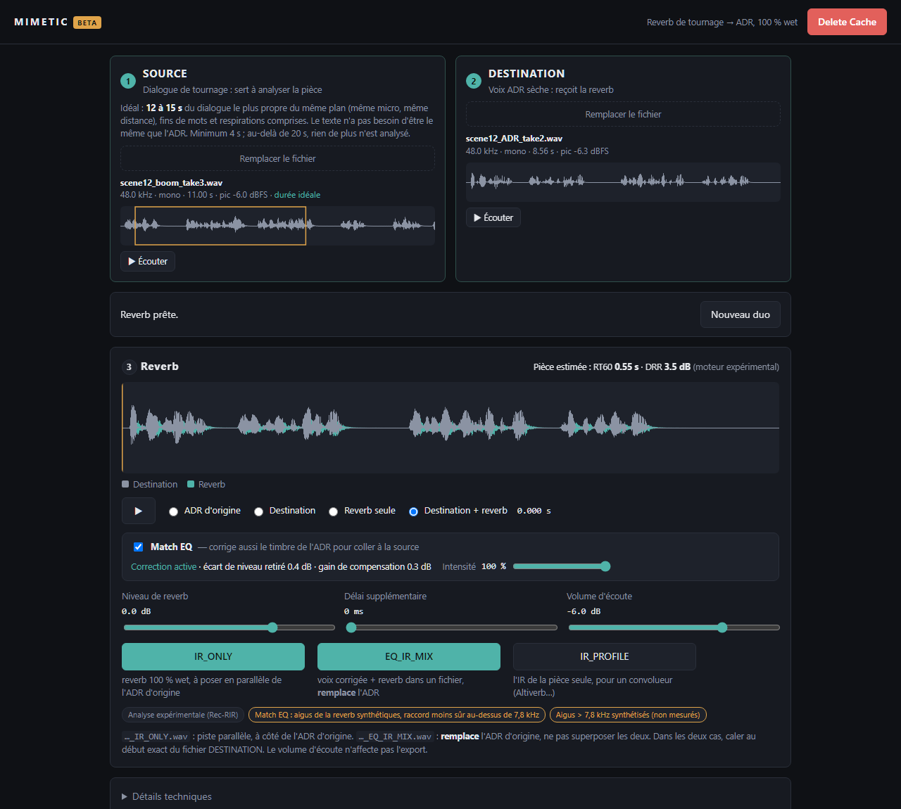

# Mimetic (beta)

Chameleon-like direct-sound IR analysis and regeneration for ADR recordings.

**Match production-dialogue reverb onto ADR.** Mimetic listens to a production recording, estimates the room it was recorded in, and renders a **100 % wet reverb stem** for a dry ADR line, ready to sit on a parallel track in your DAW.

It runs locally as a small Python web service: open the page from any computer on your LAN. No audio leaves the host machine.



## How it works

One page, three steps:

1. **SOURCE**: drop the production dialogue. It is used only to analyse the room.
2. **DESTINATION**: drop the dry ADR line. It receives the reverb.
3. Processing starts automatically:
   - **analysis**: up to three 6-second passages, picked automatically among the most active parts of the source, about 30 s of CPU time each, cancellable;
   - **render**: a few seconds.

Then listen to *Destination* / *Reverb only* / *Destination + reverb*, adjust the reverb level, and **export** `name_ADR_REVERB.wav`:
- 32-bit float WAV at the destination's sample rate;
- wet only, full tail included;
- aligned sample-for-sample with the start of the destination file.

A JSON report next to it records the estimated room, settings, peaks and limitations.

Changing the destination or the level only re-renders. Changing the source re-runs the analysis.

### Under the hood

| Stage | What happens |
|---|---|
| Room estimation | [Rec-RIR](https://github.com/Audio-WestlakeU/Rec-RIR) (Audio-WestlakeU, MIT licence), official code and weights pinned to a commit, run on **CPU** through a pure-PyTorch port of the Mamba block (the official `mamba-ssm` CUDA kernels do not run on Windows) |
| Direct / reverb split | The estimated IR is aligned on the direct sound, which is then removed, keeping the reflections and their level relative to the direct sound |
| High frequencies | Rec-RIR works at 16 kHz, so it has no information above 8 kHz. A **hybrid extension** synthesises the bands above 7.8 kHz from the measured 5–7 kHz reflection envelope, with an air-absorption-shaped decay. They are flagged as *synthesised*, never as measured |
| Render | Full linear convolution of the untouched ADR; no normalisation, no hidden limiter |

## Status and limitations

This is an **experimental beta**. Read these before trusting a result:

- **Not yet validated on real production dialogue.** All measurements so far use synthetic rooms and text-to-speech voices:
  - RT60 and direct-to-reverb ratio are within the project's pilot targets on 18 synthetic cases;
  - the proposed reverb is typically **~1.5 dB too quiet**: raise the level slider if needed.
- **High frequencies above 7.8 kHz are synthesised, not measured.** On a synthetic full-band pilot, the median level error was 1.5–2.3 dB. Very absorptive rooms come out darker than reality.
- **Reverb tail limited to about 1 s**; longer tails are truncated and flagged.
- A destination with no high-frequency content yields a reverb with none either.
- Mono processing only. Two-channel files: pick left, right or an explicit mono average.
- No authentication: anyone on the network can use the page. Trusted LAN only.

Details: [docs/model-evaluation.md](docs/model-evaluation.md), [docs/decisions.md](docs/decisions.md), [docs/validation.md](docs/validation.md). The full design document is [architecture.md](architecture.md), in French.

## Requirements

- Windows 10/11 (developed and tested there; the web service itself is cross-platform)
- Python 3.11
- About 1 GB of disk space for the analysis engine environment; a GPU is not needed

## Installation

App dependencies:

```bash
python -m pip install numpy==2.2.6 scipy==1.13.1 soundfile==0.12.1 fastapi==0.111.0 uvicorn==0.30.1
```

Analysis engine, in a separate environment (see [engine-requirements.txt](engine-requirements.txt)):

```bash
py -3.11 -m venv .venv-engine
```

```bash
.venv-engine\Scripts\python.exe -m pip install --no-cache-dir torch==2.14.0 --index-url https://download.pytorch.org/whl/cpu
```

```bash
.venv-engine\Scripts\python.exe -m pip install --no-cache-dir -r engine-requirements.txt
```

```bash
git clone https://github.com/Audio-WestlakeU/Rec-RIR.git third_party/Rec-RIR
```

```bash
git -C third_party/Rec-RIR checkout b3ac6fc1421bd58e017022037feb14f30366b46f
```

The model weights' SHA-256 is checked at start-up. Without the engine, the page states that the analysis engine is not installed; it never fakes a result.

## Running

```bash
python run_beta.py
```

The console prints the addresses to open, e.g. `http://192.168.x.x:8765`. Options: `--port`, `--host 127.0.0.1` (this machine only), `--export-dir`, `--data-dir`.

Exports go to `%LOCALAPPDATA%\Mimetic\beta\exports` by default and can also be downloaded from the page.

To reach the page from other computers, allow the port through Windows Firewall on private networks (administrator PowerShell):

```powershell
New-NetFirewallRule -DisplayName "Mimetic beta 8765" -Direction Inbound -Protocol TCP -LocalPort 8765 -Profile Private -Action Allow
```

## Tests and benchmarks

```bash
python -m pip install pytest httpx
```

```bash
python -m pytest -q
```

Benchmarks (need dry 16 kHz speech WAV files) live in [benchmarks/](benchmarks/). See [docs/model-evaluation.md](docs/model-evaluation.md) for commands and results.

## Project layout

```text
src/mimetic/
  audio/        WAV I/O, DSP (direct/wet split, convolution, IR resampling), hybrid HF extension
  engines/      recrir/ (worker, CPU Mamba port, adapter), known_ir, parametric_manual
  web/          FastAPI service and the single-page UI
  pipeline.py   render and export shared by the web service and the CLI
  cli.py        command-line tools (manual reverb / known IR, no analysis)
tests/          unit and integration tests
benchmarks/     synthetic evaluation scripts for the engine and HF extension
docs/           evaluation, decisions, validation, screenshot
```

---

**Note: the application's user interface and most of the documentation are in French.**

Conçu par Sébastien Bédard
